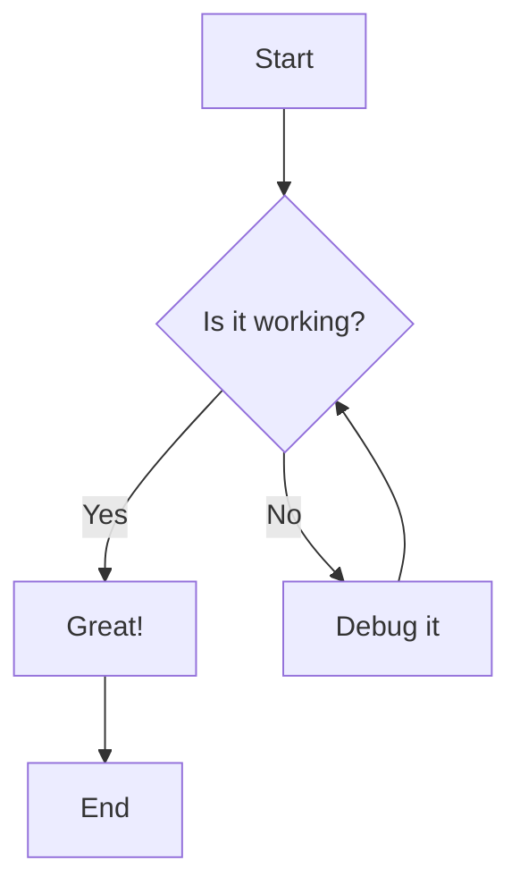
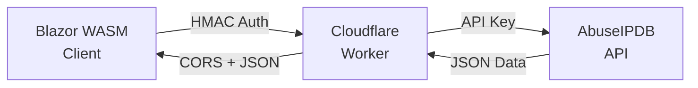

# Mermaid Diagram Test

This is a test page to verify Mermaid.js integration is working properly.

## Simple Flow Chart

## Architecture Diagram

If you can see rendered diagrams above instead of code blocks, Mermaid.js is working correctly!
